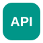

  

  

<h2 align="center">ABOUT ME</h2>

  I'm a <strong>Data &amp; AI Engineer</strong> focused on building scalable data pipelines,
  modern cloud analytics platforms, and AI-powered solutions. I work across the entire data
  lifecycle—from ingestion and transformation to modeling, reporting, and automation—using
  SQL, Python, Microsoft Fabric, Azure Data Factory, Databricks, and Power BI.

  I enjoy turning complex data problems into reliable systems that support faster and smarter business decisions.

  📍 Cali, Colombia &nbsp; • &nbsp; 💼 Data Engineering, Analytics Engineering &amp; AI
  &nbsp; • &nbsp; 🌎 Open to remote opportunities

<h2 align="center">TECH STACK</h2>

<h3 align="center">Programming, Databases &amp; Data Processing</h3>

<table align="center">
  <tr>
    <td align="center" width="120"> <strong>Python</strong></td>
    <td align="center" width="120"> <strong>SQL</strong></td>
    <td align="center" width="120"> <strong>PySpark</strong></td>
    <td align="center" width="120"> <strong>pandas</strong></td>
  </tr>
</table>

<table align="center">
  <tr>
    <td align="center" width="120"> <strong>NumPy</strong></td>
    <td align="center" width="120"> <strong>PostgreSQL</strong></td>
    <td align="center" width="120"> <strong>MongoDB</strong></td>
  </tr>
</table>

<h3 align="center">Data Engineering &amp; Cloud</h3>

<table align="center">
  <tr>
    <td align="center" width="120"> <strong>Microsoft Fabric</strong></td>
    <td align="center" width="120"> <strong>Azure Data Factory</strong></td>
    <td align="center" width="120"> <strong>Databricks</strong></td>
    <td align="center" width="120"> <strong>Apache Airflow</strong></td>
    <td align="center" width="120"> <strong>BigQuery</strong></td>
  </tr>
</table>

<table align="center">
  <tr>
    <td align="center" width="120"> <strong>AWS</strong></td>
    <td align="center" width="120"> <strong>Microsoft Azure</strong></td>
    <td align="center" width="120"> <strong>Google Cloud</strong></td>
  </tr>
</table>

<h3 align="center">Analytics &amp; Business Intelligence</h3>

<table align="center">
  <tr>
    <td align="center" width="120"> <strong>Power BI</strong></td>
    <td align="center" width="120"> <strong>Tableau</strong></td>
    <td align="center" width="120"> <strong>Excel</strong></td>
    <td align="center" width="120"> <strong>DAX</strong></td>
  </tr>
</table>

<h3 align="center">Automation &amp; DevOps</h3>

<table align="center">
  <tr>
    <td align="center" width="120"> <strong>n8n</strong></td>
    <td align="center" width="120"> <strong>GitHub Actions</strong></td>
    <td align="center" width="120"> <strong>Azure DevOps</strong></td>
    <td align="center" width="120"> <strong>Git</strong></td>
    <td align="center" width="120"> <strong>Linux</strong></td>
  </tr>
</table>

<table align="center">
  <tr>
    <td align="center" width="120"> <strong>Docker</strong></td>
    <td align="center" width="120"> <strong>GitHub</strong></td>
    <td align="center" width="120"> <strong>REST APIs</strong></td>
  </tr>
</table>

<h3 align="center">Artificial Intelligence &amp; Machine Learning</h3>

<table align="center">
  <tr>
    <td align="center" width="120"> <strong>OpenAI API</strong></td>
    <td align="center" width="120"> <strong>scikit-learn</strong></td>
    <td align="center" width="120"> <strong>PyTorch</strong></td>
    <td align="center" width="120"> <strong>TensorFlow</strong></td>
  </tr>
</table>

<table align="center">
  <tr>
    <td align="center" width="120"> <strong>Keras</strong></td>
    <td align="center" width="120"> <strong>Transformers</strong></td>
    <td align="center" width="120"> <strong>LangChain</strong></td>
    <td align="center" width="120"> <strong>Prophet</strong></td>
  </tr>
</table>

<table align="center">
  <tr>
    <td align="center" width="120"> <strong>XGBoost</strong></td>
    <td align="center" width="120"> <strong>LightGBM</strong></td>
    <td align="center" width="120"> <strong>CatBoost</strong></td>
  </tr>
</table>

<h2 align="center">LET'S CONNECT</h2>

  Interested in data engineering, analytics, or AI? Let's connect and build something impactful.

  

<!-- Featured projects will be added next. -->

