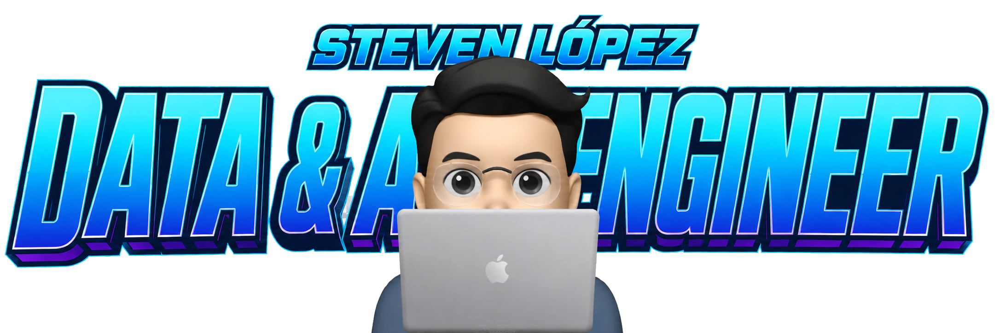

  

  

<h2 align="center">ABOUT ME</h2>

  I'm a <strong>Data &amp; AI Engineer</strong> focused on building scalable data pipelines,
  modern cloud analytics platforms, and AI-powered solutions. I work across the entire data
  lifecycle—from ingestion and transformation to modeling, reporting, and automation—using
  SQL, Python, Microsoft Fabric, Azure Data Factory, Databricks, and Power BI.

  I enjoy turning complex data problems into reliable systems that support faster and smarter business decisions.

  📍 Cali, Colombia &nbsp; • &nbsp; 💼 Data Engineering, Analytics Engineering &amp; AI
  &nbsp; • &nbsp; 🌎 Open to remote opportunities

<h2 align="center">TECH STACK</h2>

<h3 align="center">Languages &amp; Data Processing</h3>

<table align="center">
  <tr>
    <td align="center" width="120">
       
      <strong>Python</strong>
    </td>
    <td align="center" width="120">
       
      <strong>SQL</strong>
    </td>
    <td align="center" width="120">
       
      <strong>PySpark</strong>
    </td>
  </tr>
</table>

<h3 align="center">Data Engineering &amp; Cloud</h3>

<table align="center">
  <tr>
    <td align="center" width="120">
       
      <strong>Microsoft Fabric</strong>
    </td>
    <td align="center" width="120">
       
      <strong>Azure Data Factory</strong>
    </td>
    <td align="center" width="120">
       
      <strong>Databricks</strong>
    </td>
    <td align="center" width="120">
       
      <strong>Apache Airflow</strong>
    </td>
    <td align="center" width="120">
       
      <strong>BigQuery</strong>
    </td>
  </tr>
</table>

<h3 align="center">Analytics, AI &amp; Automation</h3>

<table align="center">
  <tr>
    <td align="center" width="120">
       
      <strong>Power BI</strong>
    </td>
    <td align="center" width="120">
       
      <strong>Tableau</strong>
    </td>
    <td align="center" width="120">
       
      <strong>OpenAI API</strong>
    </td>
    <td align="center" width="120">
       
      <strong>n8n</strong>
    </td>
  </tr>
</table>

<h3 align="center">DevOps &amp; Version Control</h3>

<table align="center">
  <tr>
    <td align="center" width="120">
       
      <strong>GitHub Actions</strong>
    </td>
    <td align="center" width="120">
       
      <strong>Azure DevOps</strong>
    </td>
    <td align="center" width="120">
       
      <strong>Git</strong>
    </td>
  </tr>
</table>

<!-- Featured projects and contact sections will be added next. -->
